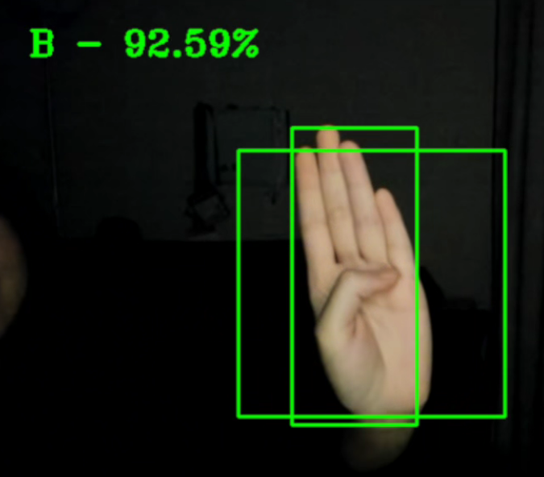
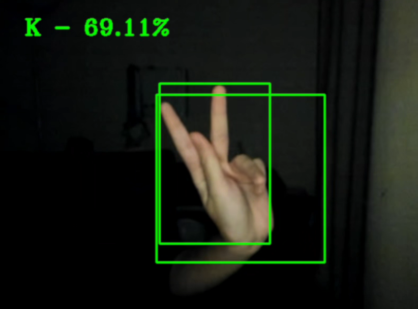
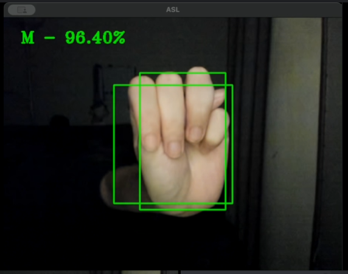
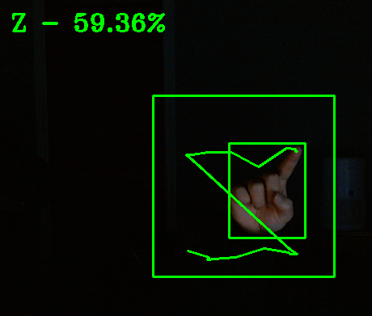

# Computer Vision - American Sign Language (ASL) Recognition

### This project uses a pre-trained ASL model from kaggle as follows:
https://www.kaggle.com/models/sayannath235/american-sign-language/

# How to run
- open the project preferably in a virtual or conda environment
- install dependies via: pip install -r requirements.txt
- should run after this, may take up to a couple of minutes to load the program

# Individual Contribution
Annabel Chao 
- Camera Implementation & reading frames
- model image processing (224x224, normalization)
- text adding, resolution changing functionality 
- caching optimization
- (attempted) asyncronous multithreading
- code review
- report contribution

Thao Nguyen
- filter preprocessing for model
- prediction confidence percentage scale
- (attempted) moving J and Z model detection (mediapipe)
- (attempted) algorithm speed and prediction optimization
- video demonstration of code
- report contribution

Jessica Zhu
- extra dimension for model processing functionality 
- code error handling
- (attempted) moving J and Z model detection
- code review
- IEEE report 

Julia Khong
- picked out keras ASL model
- model precision testing & application user testing
- drawn box tracking hand movement (mediapipe)
- (attempted) precise hand joint movement (UI)
- Created the Installation guide
- IEEE report

## Screenshots

| B | K |
|---|---|
|  |  |

| M | Z |
|---|---|
|  |  |

## Contributor Information 

| Annabel Chao  | Thao Nguyen | Jessica Zhu  | Julia Khong |
| ------------- | ------------- | ------------- | ------------- |
| [@Areichao](https://github.com/Areichao) | [@thaothecow](https://github.com/thaothecow) | [@jessicaz831](https://github.com/jessicaz831) | [@P3anutz](https://github.com/P3anutz) |

## Academic Context

This project was developed as part of coursework at Toronto Metropolitan University (TMU).
The assignment was open-ended, and the design and implementation of this project were independently developed by the author(s).
This repository contains only the author's original code and does not include any proprietary course materials.

The code in this repository is released under the MIT License. Any third-party
models, datasets, or libraries used in this project remain under their own
respective licenses and are not redistributed here.